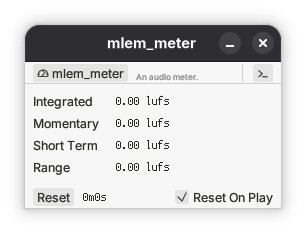
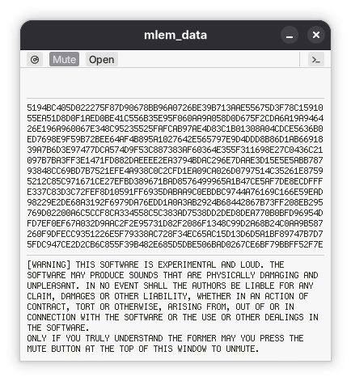

# Mlem Plugins

A playground for audio plugins developed in Rust by [Mlem Records](https://mlemrecords.com/). Mostly for my personal enjoyment. I'm happy to see anyone get use out of these though.

Plugins and their underlying code are licensed under the [ANTI-CAPITALIST SOFTWARE LICENSE (v 1.4)](LICENSE). If you need a different license, feel free to contact [puk@mlemrecords.com](mailto:puk@mlemrecords.com).

Published builds contain CLAP, VST3 and Standalone versions.

## Includes

- [mlem_base](mlem_base) 0.1.2 - A plugin base.
- [mlem_egui_themes](mlem_base) 0.1.2 - An egui theming library.
- [mlem_meter](mlem_meter) 0.1.2 - An audio meter.
    > Measures input according to the [LUFS](https://en.wikipedia.org/wiki/LUFS) standard.
    > 
    > 
- [mlem_data](mlem_data) 0.1.0 - A raw data synthesizer.
    > Takes files as input, outputs audio.
    > 
    > 
- [lua_garden_plug](lua_garden_plug) - Total WIP.
- mlem_dynrange - TBM - A manual linear dynamic range remapper. 

## Building

Current platform example:

```
cargo xtask bundle mlem_meter --release
```

For windows:
```
cargo xtask bundle mlem_meter --release --target x86_64-pc-windows-gnu
```

## Dependencies

- Uses nih-plug under ISC.
- Uses Phosphor icons under MIT.
- Uses egui under MIT.
